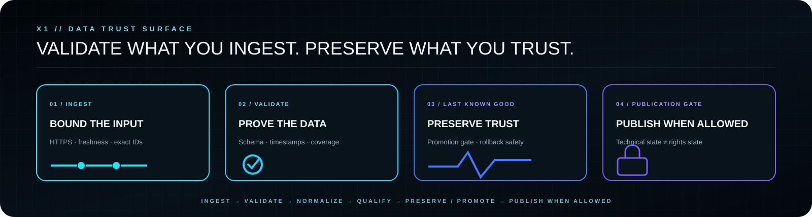

<p align="center">
  
</p>

<p align="center">
  <strong>PUBLIC · COMMUNITY · DATA CONTROL</strong><br>
  Validation-first XMLTV control for canonical IDs, source qualification, provenance and last-known-good safety.
</p>

<p align="center">
  <a href="https://x1panelhq.com"><strong>WEBSITE</strong></a>
  &nbsp;·&nbsp;
  <a href="https://forum.x1panelhq.com"><strong>FORUM</strong></a>
  &nbsp;·&nbsp;
  <a href="https://discord.gg/vSSw6jHmw"><strong>DISCORD</strong></a>
  &nbsp;·&nbsp;
  <a href="https://t.me/+XkuQS_QuD6g4Nzc0"><strong>TELEGRAM</strong></a>
</p>

---

## X1 EPG

**X1 EPG is a validation-first XMLTV control system for the X1 ecosystem.**

> **Free means functional.**
> The public project is intended to be useful as released while preserving explicit technical, approval and redistribution boundaries.

X1 EPG is not a static list of channels and it is not a blind XMLTV mirror. It ingests external programme data, validates it, normalizes it into stable X1 channel identities, evaluates source quality, preserves the last-known-good state when refreshes fail and records evidence about what was observed.

The project deliberately keeps three decisions separate: **technical quality**, **source approval** and **redistribution rights**.

<p align="center">
  
</p>

---

<p align="center">
  
</p>

## Operating model

`INGEST` → `VALIDATE` → `NORMALIZE` → `QUALIFY` → `PROMOTE / PRESERVE LKG` → `PUBLISH WHEN ALLOWED`

A completed build is not automatically trusted state.

> **BUILD ≠ ACTIVE**

---

## Current public scope

Canonical manifests currently exist for:

`PT` Portugal · `ES` Spain · `FR` France · `DE` Germany · `IT` Italy · `GB` United Kingdom · `CH` Switzerland · `NL` Netherlands

Brazil remains candidate-oriented pending the same qualification discipline applied to the currently approved country manifests.

Channel identity is country-first and uses stable `canonicalId` values. Where possible, X1 EPG aligns channel identities with the X1 picon catalogue without coupling runtime behaviour to upstream provider naming.

---

## Runtime safety model

Key controls include:

- strict XMLTV timestamps with explicit timezone offsets;
- exact upstream channel-ID preflight checks;
- bounded HTTPS fetching with size limits, redirect policy and private-network / SSRF protection;
- source freshness checks;
- deterministic deduplication and sorting;
- no fuzzy automatic remapping of missing channel IDs;
- no automatic candidate promotion;
- advisory quality recommendations with anti-flap protection;
- failure forensics with stable issue classification;
- last-known-good promotion and rollback protection.

A failed refresh is not treated as permission to replace a valid catalogue with partial, stale or structurally invalid data.

---

## Last Known Good

X1 EPG separates **candidate output** from **active trusted output**.

The pipeline can build a new index, but runtime validation and policy gates decide whether that index becomes the new last-known-good state. If validation fails, the previous accepted state is preserved.

---

## Provenance and integrity

The current source implementation includes:

- run identity and manifest inventory;
- upstream artefact digests;
- output digests;
- last-known-good decision evidence;
- chained integrity records;
- Ed25519 signing support prepared for operational key provisioning;
- key-rotation policy tooling;
- external-anchor contract tooling.

These mechanisms prove observed bytes and state transitions. They do not grant content rights and they do not turn unverified runtime execution into a production-success claim.

Operational signing remains dependent on approved X1 key provisioning. External anchoring remains dependent on a configured external trust service.

---

<p align="center">
  
</p>

## Publication / responsibility boundary

X1 EPG treats public availability and redistribution permission as different things.

The current known source posture is conservative:

- EPGShare01 can be technically ingested and evaluated, but explicit redistribution rights have not been proven for X1 publication;
- dobleM remains candidate / qualification material unless explicitly approved and rights-compatible;
- EPG.PW is not treated as an automatically usable commercial redistribution source;
- stale or historically useful feeds may remain useful as channel-ID evidence without becoming production fallbacks.

> **Ingest can be allowed while publish remains blocked.**

Public XMLTV output must remain fail-closed until the selected source is technically valid **and** publication rights are proven compatible with X1 use.

---

## Repository layout

```text
sources/             approved source manifests
countries/           per-country generated/catalogue outputs
data/                indexes, schemas, evidence and runtime reports
tools/               validators, qualification, quality, provenance and safety tooling
tests/               deterministic tooling tests
.github/workflows/   scheduled and manually dispatched validation/sync workflows
```

---

## Core tools

`validate_sources` · `validate_channel_lists` · `sync_epg` · `build_index` · `global_validate` · `catalog_coverage` · `compare_sources` · `quality_engine` · `decision_guard` · `runtime_failure_forensics` · `lkg_guard` · `run_provenance` · `integrity_chain` · signed provenance / rotation / anchor support

The exact runtime state of a workflow is not inferred from source code. Source implementation, tests, CI execution and production behaviour remain distinct evidence classes.

---

## Engineering rules

**EXACT IDS OVER GUESSING** · **LKG OVER BAD REFRESHES** · **STRICT TIMEZONES** · **BOUNDED NETWORK I/O** · **NO AUTO-PROMOTION** · **PROVENANCE OVER ASSUMPTION** · **RIGHTS FAIL CLOSED**

---

## Related X1 systems

- [X1 GitHub](https://github.com/x1-dotcom)
- [X1 Picons](https://github.com/x1-dotcom/picons)
- [X1 Stream Manager Community](https://github.com/x1-dotcom/X1-Stream-Manager-Community)

---

## Community

- Website — https://x1panelhq.com
- Forum — https://forum.x1panelhq.com
- Discord — https://discord.gg/vSSw6jHmw
- Telegram — https://t.me/+XkuQS_QuD6g4Nzc0

---

<p align="center">
  <strong>VALIDATE WHAT YOU INGEST. PRESERVE WHAT YOU TRUST. PUBLISH ONLY WHAT YOU MAY REDISTRIBUTE.</strong><br><br>
  <strong>X1 // SOFTWARE · SYSTEMS · OPERATIONS</strong><br><br>
  PUBLIC SOFTWARE. PRIVATE ENGINEERING. ONE X1 IDENTITY.<br><br>
  <strong>© X1Tech Solutions SA · All Rights Reserved</strong>
</p>
